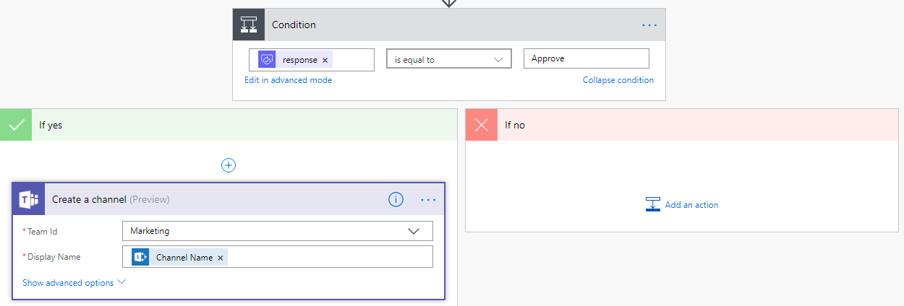

# Teams + Flow

Create flows that automate repetitive work tasks—and trigger right from your Microsoft Teams data.
Explore Teams Templates and connectors at <https://flow.microsoft.com/en-us/connectors/shared_teams/microsoft-teams/>

## Lab 1 - Create an approval flow that posts notification messages to teams

Let’s imagine that you’re the Chief Compliance Officer at the Legal department at Contoso Inc. You want to send out an approval request whenever a new document is uploaded to the Legal folder in a SharePoint document library. To inform approvers and ensure everyone has visibility into any feedback, you want to notify your teammates on Microsoft Teams. With the Flow integration in Teams, you can quickly create a flow and boost your team’s productivity.

1. Setup

    Go to Microsoft Teams and add a channel named "Legal" to your favorite test Team.

    *Note: Alternatively, if you are using a Contoso Microsoft demo tenant, you could use the "X1050 Launch" team and "Legal and Compliance" channel for this lab.*

2. Install the Flow app

    Open Microsoft Teams and Install the Flow app from the Teams’ Store. To access the Store, click on the icon at the bottom of the left-hand navigation bar. Then, choose the Flow app from **Top picks** or type "Flow" in the search box.

3. Create a new flow in Teams

    * Once you’ve installed the app, you’ll notice four tabs – Conversation, Flows, Approvals, and About. The Conversation tab enables you to interact with the FlowBot, the Flows tab allows you to create new flows and manage existing ones, and the Approvals tab lists your received and sent approval requests. Click on the Flow tab and Sign in. Then, click on the **Create from template button**.

    * You can choose from several templates, connecting your Team to services like SharePoint, Microsoft Forms, Dynamics, Twitter, PowerBI, and UserVoice. Select the template titled **Start approval for new documents and notify via Teams**. Clicking on the template, will open the Flow designer.

    * For the trigger, **When a file is created**, select the SharePoint site and library hosting the data for your team.  For the Post message actions, select the Team and Channel for the Legal department. Finally, enter the names of your teammates for the Start approval action.

    *Note – All of the SharePoint files triggers and actions are usable for your team’s file library as the underlying data source is SharePoint.*

    * Save the flow by clicking the **Create flow** button.

## Lab 2 - Create a Teams channel request with flow

Some governance policies might not allow their Teams members create channels in a team. This can be enforced in the team settings or the admin center. One solution for adding channels in a goverened way is to create a request list for channel approvals and on approval, have flow automatically create the channel.

1. Setup

    * Go to your favorite SharePoint Site (or create one) something like "IT". Create a new request list by going to **Site Contents** from the site *gear* in the upper right corner then **+New** ... **List** and name it "Teams Channel Request"

    * Add a few columns
        * Channel Name (single line of text)
        * Channel purpose (Multiple lines of text)
        * Requestor (person or group)

    * Go to **List Settings** from the site *gear* in the upper right corner then **Version Settings** ... then set *Require content approval for submitted items* to **Yes**.

2. Create your Flow

    * To get started, Open Microsoft Flow from your waffle then click on **My Flows** then on **Create from Blank**.

        *Note: Take a moment to search for "Teams" triggers and notice the new triggers to see the possibilities*
        1. *When there's a new message in a channel - This operation triggers when a new message is posted to a channel in a Team.*
        2. *When you are @mentioned in a channel - This operation triggers when a new message is added to a channel in a Team, that mentions the current user.*

    * For this Flow, we will use a SharePoint trigger. Search for "SharePoint" and select **When an item is created or modified**. Select or copy and paste in the Site Address where the SharePoint list is located. Select the List Name "Teams Channel Request" from the dropdown.

    * Click on **Add an action** then search for "Start an approval". Once added, fill out the approval fields as shown below. Click on **Dynamic content** to add the Channel Name and Link to item. In the Assigned to field enter the team owner(s).

        

    * Click on **Add an action** then search for the "Condition Control". Once added, click on dynamic content to select Response, select "is equal to" from the dropdown and then type in Approve. Click on Add an action underneath the If yes section. Search for Teams then select **Create a channel**. Select the Team for the Team Id field and then select Channel Name from the dynamic content for the Display Name.

        

## Lab 3 - Hacker edition: Create a PowerApp form view for request list and add it as a tab in the Team channel.**
